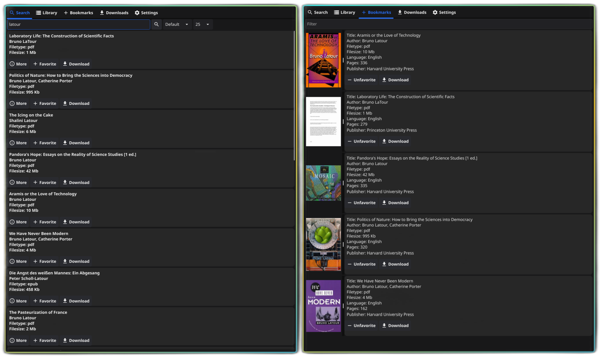

<sub>
<p align='center'></p>
</sub>
<h1 align="center">Aletheia Desktop</h1>

<p align='center'></p>


Aletheia is a desktop application for Library Genesis written in Go. It supports downloading books, converting them to different 
formats (requires Calibre to be installed), and sending the book to your Gmail for easy access on other devices.

## Installation

### Use Binary Packages

Download the latest binary package from [releases](https://github.com/onurhanak/AletheiaDesktop/releases) and run it.

### Run From Source Code

#### Steps

**If you are compiling for Windows, you need to have [Docker](https://docker.com) installed.**

1. Clone the repository:
    ```sh
    git clone https://github.com/onurhanak/AletheiaDesktop.git
    cd AletheiaDesktop
    ```

2. Install dependencies:
    ```sh
    go mod tidy
    ```

3. Build the application:
    ```sh
    make linux
    ```
   
    or
    ```sh
    make windows
   ```

You can find the binaries in fyne-cross/bin folder.

## How-to

### Converting Books

For this feature to work you need to install Calibre. On most Linux distributions it is shipped in the core repos. 

On Windows, visit [Calibre Downloads](https://calibre-ebook.com/download) to install it.

After that you can click on the convert button on the book items in your library to convert them to EPUB, PDF, MOBI, 
DJVU formats.

### Emailing Books

For this feature to work you need to enter your email address and password in the Settings tab. 
You need to create an 
[App Password](https://support.google.com/accounts/answer/185833?hl=en). 

Simply visit https://myaccount.google.com/apppasswords and create a password for Aletheia to use and enter it as a 
password under the Settings tab along with your email address.

## Contributing

Contributions are welcome! Feel free to open an issue or submit a pull request.

## License

This project is licensed under the Unlicense license - see the [LICENSE](LICENSE) file for details.